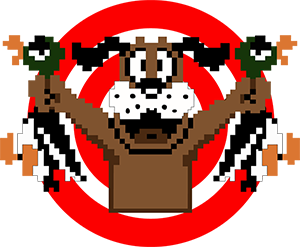

Duck-Hunt
=========

Duck Hunt Dog Konami Code

This is a variation of the raptoize Konami code. This version has the duck hunt dog form Nintendo.

Here is a demo http://dplumly.github.io/Duck-Hunt

Just enter the code and watch the magic!

To use this on your website just add the following code to the bottom of your site:

    
    
    
     

        
    
        
        <audio style="visibility:hidden;" id="perfectScore" preload="auto">
            <source src="perfectScore.mp3">
            <source src="perfectScore.ogg">
        </audio>

You can easily add different music and a .png
